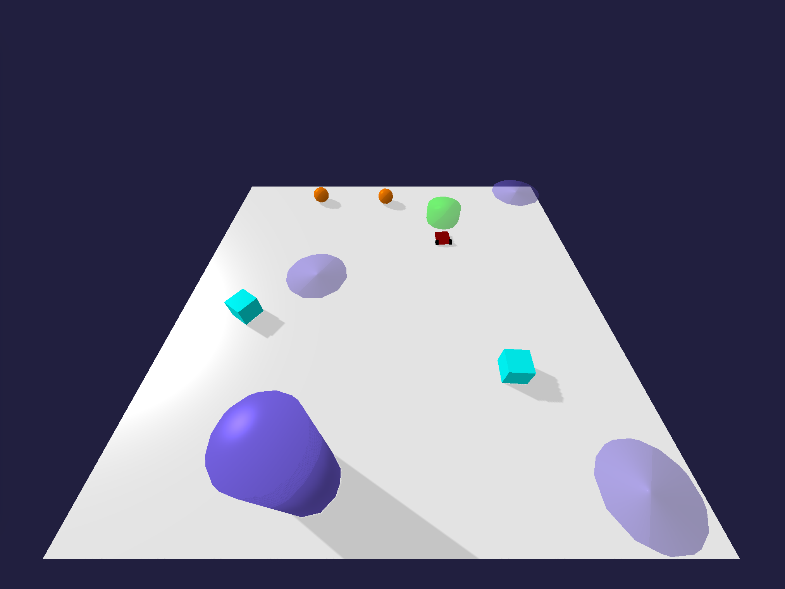
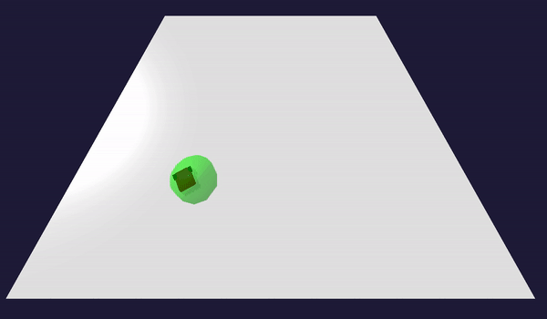
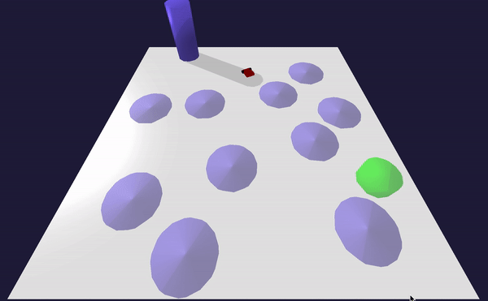
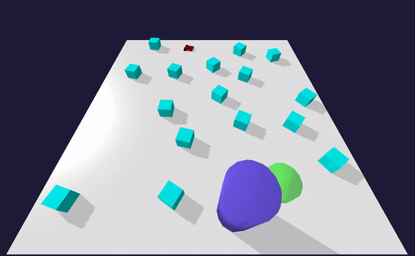
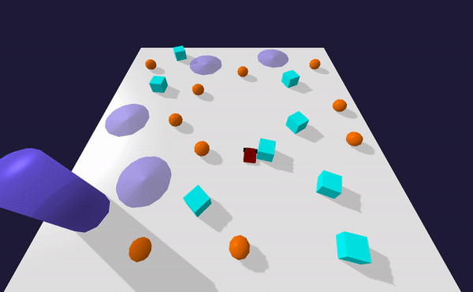

# gym-aeris
robotics environments for reinforcement learning

this environment is inspired by OpenAI safety-gym  https://openai.com/blog/safety-gym/ 
which is open source, but running on closed source mujoco

simulated lidar scan

# TODO

* ~~**env is still not working**, just first committ and proof Iam doing something~~
* not tested yet - some lidar smoothing necessary
* install into gym
* ~~observation and rewards finish~~
* train some baselines
* multirobot support

# install

dependences : numpy, pybullet, gym

TODO installing into gym

# environments

## navigate to target **TargetNavigateEnv**

robot have to navigate to target

- for reaching target reward +1 obtained
- for falling down, reward -1

observation :
tensor with shape (4, 32)
- channel 0 : left robot wheel velocity
- channel 1 : right robot wheel velocity
- channel 2 : 32 points lidar data of obstacles position
- channel 3 : 32 points lidar data of target position

actions : continuous two motors controll, (-1, 1)

## avoid hazards, **AvoidHazardsEnv**

robot have to navigate to target, and avoid hazard areas
- for reaching target reward +1 obtained
- for falling down, reward -1, episode ends
- for hitting hazard, reward -1, episode ends

observation :
tensor with shape (5, 32)
- channel 0 : left robot wheel velocity
- channel 1 : right robot wheel velocity
- channel 2 : 32 points lidar data of obstacles position
- channel 3 : 32 points lidar data of target position
- channel 4 : 32 points lidar data of hazards position

actions : continuous two motors controll, (-1, 1)

## avoid fragiles, **AvoidFragilesEnv**

robot have to navigate to target, and avoid hazard areas, and be careful to fragile objects
- for reaching target reward +1 obtained
- for falling down, reward -1, episode ends
- for hitting hazard, reward -1, episode ends
- for contact fragile, reward -0.1

observation :
tensor with shape (6, 32)
- channel 0 : left robot wheel velocity
- channel 1 : right robot wheel velocity
- channel 2 : 32 points lidar data of obstacles position
- channel 3 : 32 points lidar data of target position
- channel 4 : 32 points lidar data of hazards position
- channel 5 : 32 points lidar data of fragiles position

actions : continuous two motors controll, (-1, 1)

## advanced food gathering, **FoodGatheringAdvancedEnv**

robot have to gather foods, and avoid hazard areas, and be careful to fragile objects
- for reaching food reward +1 obtained
- for falling down, reward -1, episode ends
- for hitting hazard, reward -1, episode ends
- for contact fragile, reward -0.1

observation :
tensor with shape (6, 32)
- channel 0 : left robot wheel velocity
- channel 1 : right robot wheel velocity
- channel 2 : 32 points lidar data of obstacles position
- channel 3 : 32 points lidar data of hazards position
- channel 4 : 32 points lidar data of fragiles position
- channel 5 : 32 points lidar data of food position

actions : continuous two motors controll, (-1, 1)

